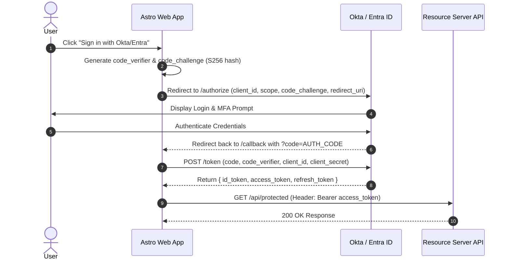

# 📖 Phase 2: OpenID Connect (OIDC) & OAuth 2.0 Deep Dive

> 🛡️ **Zero Trust Lens:** OIDC and OAuth 2.0 are the backbone of Zero Trust identity. They enable **Verify Explicitly** at every step — short-lived access tokens, audience-scoped permissions, PKCE anti-replay protection, and dynamic JWKS-based key rotation. No network location is trusted; only cryptographically verified tokens grant access.

---

## 1. OIDC vs. OAuth 2.0: Understanding the Distinction

| Feature | OAuth 2.0 | OpenID Connect (OIDC) |
| :--- | :--- | :--- |
| **Primary Purpose** | **Authorization** (Delegated Access) | **Authentication** (Identity Verification) |
| **Key Token Produced** | `access_token` (Opaque or JWT) | `id_token` (JWT format required) |
| **Analogy** | Hotel Keycard (Grants access to Room 402) | Passport / Driver's License (Proves who you are) |
| **Standard Endpoints** | `/authorize`, `/token` | `/authorize`, `/token`, `/userinfo`, `/.well-known/openid-configuration` |

---

## 2. Authorization Code Flow with PKCE (Proof Key for Code Exchange)

> [!IMPORTANT]
> **Zero Trust Requirement:** Always use Authorization Code Flow with PKCE — never Implicit Flow. PKCE ensures that even if the authorization code is intercepted in transit, it cannot be exchanged for tokens without the matching `code_verifier`.

PKCE (pronounced *"pixie"*) prevents authorization code injection and interception attacks on public clients (Single Page Apps, Mobile, SSR web apps).



---

## 3. Okta OIDC & Entra ID Specifics

### Okta OIDC Endpoint Endpoints
* **Discovery URL:** `https://dev-YOUR-TENANT.okta.com/oauth2/default/.well-known/openid-configuration`
* **Authorization Endpoint:** `https://dev-YOUR-TENANT.okta.com/oauth2/default/v1/authorize`
* **Token Endpoint:** `https://dev-YOUR-TENANT.okta.com/oauth2/default/v1/token`
* **JWKS Endpoint:** `https://dev-YOUR-TENANT.okta.com/oauth2/default/v1/keys`
* **Official Ref:** [Okta OpenID Connect & OAuth 2.0 API](https://developer.okta.com/docs/reference/api/oidc/)

### Microsoft Entra ID Endpoint Endpoints
* **Discovery URL:** `https://login.microsoftonline.com/YOUR_TENANT_ID/v2.0/.well-known/openid-configuration`
* **Authorization Endpoint:** `https://login.microsoftonline.com/YOUR_TENANT_ID/oauth2/v2.0/authorize`
* **Token Endpoint:** `https://login.microsoftonline.com/YOUR_TENANT_ID/oauth2/v2.0/token`
* **JWKS Endpoint:** `https://login.microsoftonline.com/common/discovery/v2.0/keys`
* **Official Ref:** [Microsoft Entra ID v2.0 Protocols](https://learn.microsoft.com/en-us/entra/identity-platform/v2-protocols)

---

## 4. Token Payload Structure & Zero Trust Validation Requirements

> [!IMPORTANT]
> **Zero Trust Checklist** — every Resource Server MUST verify all of the following on every request:
> - ✅ `iss` (Issuer) matches your exact IdP URL
> - ✅ `aud` (Audience) matches your specific API identifier
> - ✅ `exp` (Expiration) is in the future
> - ✅ `nbf` (Not Before) has passed
> - ✅ Signature verified via JWKS (never accept `alg: none`)
> - ✅ Required `scp` / `roles` / `permissions` claims are present

### ID Token (`id_token`) Payload
```json
{
  "sub": "00u1a2b3c4d5e6f7g8h9",
  "name": "Jane Doe",
  "email": "jane.doe@company.com",
  "preferred_username": "jane.doe@company.com",
  "ver": "1.0",
  "iss": "https://dev-123456.okta.com/oauth2/default",
  "aud": "0oaxxxxxxxxxx357",
  "iat": 1755000000,
  "exp": 1755003600
}
```

### Access Token (`access_token`) Payload
```json
{
  "sub": "00u1a2b3c4d5e6f7g8h9",
  "iss": "https://dev-123456.okta.com/oauth2/default",
  "aud": "https://api.authmatrix.local",
  "client_id": "0oaxxxxxxxxxx357",
  "scp": ["read:reports", "write:users"],
  "groups": ["Admin", "SecurityEngineers"],
  "exp": 1755003600
}
```

---

## 5. Lab Hands-On: Code Verifier & Challenge Generator (TypeScript)

```typescript
import crypto from 'crypto';

// Step 1: Generate Cryptographic High-Entropy Code Verifier
export function generateCodeVerifier(): string {
  return crypto.randomBytes(32).toString('base64url');
}

// Step 2: Hash Verifier with SHA-256 to create Code Challenge
export function generateCodeChallenge(verifier: string): string {
  return crypto
    .createHash('sha256')
    .update(verifier)
    .digest('base64url');
}
```
