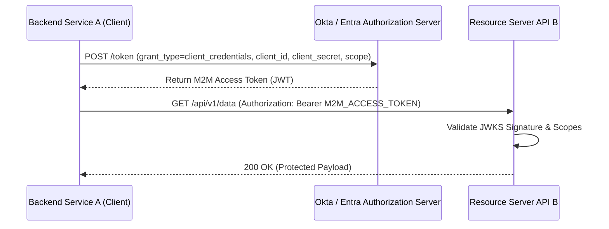

# 📖 Phase 4: API Security, JWKS & Token Validation (Resource Server Pattern)

> 🛡️ **Zero Trust Lens:** Resource Servers are the enforcement point of Zero Trust. They **never trust** a request without first cryptographically verifying the Bearer token. They fetch public keys dynamically from JWKS endpoints — never hardcode secrets. Every endpoint enforces least-privilege scope checks. This is **Assume Breach** architecture: even tokens from internal services are validated.

---

## 1. The Resource Server Decoupled Pattern

```
+---------------+                +------------------------+                +------------------+
| Client App    | -- 1. Bearer ->| Resource Server API    | -- 2. JWKS --->| Authorization    |
| Astro Web /   |    Access      | Express (Port 4000)    |    Public Keys | Server (Okta /   |
| Mobile / M2M  |    Token       | (Validates RS256 Signature)              | Entra ID)        |
+---------------+                +------------------------+                +------------------+
```

---

## 2. Token Validation Step-by-Step Checklist (Zero Trust Standard)

> [!IMPORTANT]
> **Zero Trust Mandate:** Every secure Resource Server MUST execute ALL of the following checks before granting access. Skipping any step — especially issuer or audience validation — creates a security gap that attackers can exploit.

Every secure Resource Server API MUST execute the following checks before granting access:

1. **Header Extraction:** Extract `Authorization: Bearer <TOKEN>` header. Reject missing or malformed headers with `401 Unauthorized`.
2. **Algorithm Check:** Ensure `header.alg` is `RS256` or `ES256`. **Never allow `alg: none`!** (This disables all cryptographic verification.)
3. **Key ID (`kid`) Lookup:** Extract `header.kid` and retrieve the matching public key from the IdP's JWKS endpoint (`/.well-known/jwks.json`).
4. **Signature Verification:** Use the public key to verify the cryptographic signature. Any signature failure = immediate `401`.
5. **Issuer (`iss`) Validation:** Assert that `payload.iss` exactly matches your expected IdP issuer URL.
6. **Audience (`aud`) Validation:** Assert that `payload.aud` matches your API's audience identifier. Without this, tokens intended for Service A are accepted by Service B.
7. **Expiration (`exp`) & Not-Before (`nbf`) Checks:** Reject expired tokens. Clock skew tolerance must not exceed 5 minutes.
8. **Scope / Role Authorization:** Assert that `payload.scp` or `payload.roles` contain the required permission for the specific endpoint.

> [!WARNING]
> **JWKS Caching:** Cache IdP public keys locally (TTL: 1–24 hours) but always refresh when a new `kid` is encountered. Never hardcode public keys — IdPs rotate them.

---

## 3. Machine-to-Machine (M2M) OAuth 2.0 Client Credentials Grant

When two backend services communicate directly without a human user in the loop:



---

## 4. Official Platform API Security Documentation

* **Okta API Access Management:** [Validate Access Tokens in Okta](https://developer.okta.com/docs/guides/validate-access-tokens/)
* **Microsoft Entra ID Protected APIs:** [Validate Tokens in Protected Web APIs](https://learn.microsoft.com/en-us/entra/identity-platform/scenario-protected-web-api-overview)
