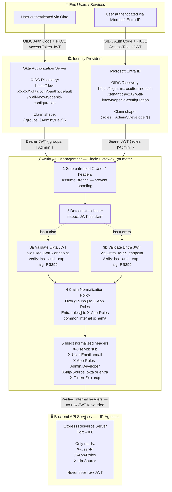

# ADR-SEC-2026-001: Identity Federation & API Authorization Architecture

| Field | Value |
|:---|:---|
| **ADR ID** | ADR-SEC-2026-001 |
| **Title** | Dual-IdP OIDC Federation with Azure APIM Claim Normalization |
| **Status** | Accepted |
| **Date** | 2026-08-13 |
| **Deciders** | AuthMatrix Architecture Team |
| **Context** | AuthMatrix / Okta Labs — Multi-IdP API Authorization Design |
| **Zero Trust Tenet** | Verify Explicitly · Assume Breach |

---

## 1. Context & Problem Statement

AuthMatrix must support users authenticating from **two distinct enterprise identity providers** — Okta and Microsoft Entra ID — while exposing a **single, consistent API surface** to backend microservices. Each IdP issues tokens using different claim schemas for role/group identity, creating a normalization problem at the API authorization layer.

The critical design tension is:

> Where does claim normalization live — at the API Gateway edge, or in each backend service?

Forcing each backend to understand both Okta `groups` and Entra `roles` creates tight coupling between business logic and IdP-specific token schemas, directly violating the Zero Trust principle of **IdP-agnostic, explicit per-request verification**.

---

## 2. Architecture Diagram



---

## 3. Identity Provider Comparison: Claim Schemas

### 3.1 Okta — Groups Claim (OIDC)

Okta embeds group membership in the `groups` claim on the access token. This requires configuration in the **Authorization Server Claims** panel in Okta Admin.

**Token payload (Okta-issued access token):**
```json
{
  "sub": "00u1a2b3c4d5e6f7",
  "iss": "https://dev-123456.okta.com/oauth2/default",
  "aud": "https://api.authmatrix.local",
  "exp": 1755003600,
  "iat": 1755000000,
  "email": "jane.doe@company.com",
  "groups": ["Admin", "SecurityEngineers", "Everyone"]
}
```

**Mapping requirement:** Extract specific group names from the `groups` array and map them to internal application roles. The APIM policy applies a lookup: `groups contains "Admin"` → set `X-App-Roles: Admin`.

### 3.2 Microsoft Entra ID — App Roles Claim (OIDC)

Entra embeds application-level roles in the `roles` claim. App Roles are defined on the **Enterprise Application** object and assigned to users or groups inside the Entra portal.

**Token payload (Entra-issued access token):**
```json
{
  "sub": "a1b2c3d4-e5f6-7890-abcd-ef1234567890",
  "iss": "https://login.microsoftonline.com/TENANT_ID/v2.0",
  "aud": "api://authmatrix-app-client-id",
  "exp": 1755003600,
  "iat": 1755000000,
  "email": "jane.doe@company.com",
  "roles": ["Admin", "Developer"]
}
```

**Mapping requirement:** The `roles` claim already uses structured application role names defined by the developer in the App Registration manifest. Minimal transformation is needed — the APIM policy reads `roles` directly.

---

## 4. Per-Layer Comparison Table

| Layer | Okta (OIDC) | Microsoft Entra ID (OIDC) |
|:---|:---|:---|
| **Authentication Protocol** | OIDC Authorization Code + PKCE | OIDC Authorization Code + PKCE |
| **Token Algorithm** | RS256 (asymmetric) | RS256 (asymmetric) |
| **OIDC Discovery URL** | `https://dev-XXXXX.okta.com/oauth2/default/.well-known/openid-configuration` | `https://login.microsoftonline.com/{tenantId}/v2.0/.well-known/openid-configuration` |
| **Role Source** | `groups` claim (Okta Groups) | `roles` claim (Entra App Roles) |
| **Role Definition Location** | Okta Admin: Groups created → users assigned → claim rule added to Auth Server | Entra Admin: App Roles defined in manifest → assigned to users/groups via Enterprise App |
| **Token `aud` (Audience)** | Custom API audience set in Auth Server | App registration URI `api://client-id` |
| **Claim Shape** | `"groups": ["Admin","Developers"]` | `"roles": ["Admin","Developer"]` |
| **Claim Normalization** | `groups[]` → `X-App-Roles` header | `roles[]` → `X-App-Roles` header |
| **API Gateway** | Azure APIM (validates via Okta JWKS) | Azure APIM (validates via Entra JWKS) |
| **Backend API Sees** | `X-App-Roles: Admin` (normalized) | `X-App-Roles: Admin` (normalized) |
| **Backend IdP Awareness** | ❌ None — IdP-agnostic | ❌ None — IdP-agnostic |

---

## 5. Decision: Claim Normalization Location

### Option A — Normalization in APIM Inbound Policy ✅ Recommended

All IdP-specific claim translation logic lives in the APIM **inbound policy** XML. Backend services only ever receive pre-normalized HTTP headers and never process raw JWT claims.

**Pros:**
- Backend services are completely IdP-agnostic — adding a third IdP (PingFederate, Auth0, ADFS) requires zero backend code changes
- Single normalization point — easier to audit, test, and maintain
- Aligns with Zero Trust **Assume Breach**: backend never trusts a raw token; it only trusts gateway-verified headers
- APIM policies are version-controlled and deployable as infrastructure-as-code

**Cons:**
- Complex normalization logic (e.g., multi-group priority rules) can be verbose in XML policy language
- APIM policy debugging tooling is less ergonomic than application code

---

### Option B — Partial Normalization in Backend ❌ Not Recommended

APIM forwards the raw `Authorization: Bearer <JWT>` to the backend, and each service re-validates and normalizes claims.

**Cons:**
- Every backend service must implement JWKS fetching, signature verification, and IdP-specific claim parsing
- Adding a new IdP requires simultaneous changes across all downstream services
- Violates separation of concerns — IdP coupling pollutes business logic code
- Significantly larger attack surface: raw tokens traverse the internal network

---

### Decision: Option A (APIM-Only Normalization)

> Claim normalization **MUST** reside entirely in the APIM inbound policy. Backend APIs are IdP-agnostic and only consume normalized headers injected by the gateway. This is the only architecture consistent with Zero Trust **Assume Breach** and **Least Privilege** principles.

---

## 6. Azure APIM Inbound Policy: Claim Normalization

```xml
<inbound>
    <!-- ══════════════════════════════════════════════════════
         STEP 1 — ZERO TRUST: Strip all untrusted client headers
         Prevents attackers from injecting spoofed identity headers
         ══════════════════════════════════════════════════════ -->
    <set-header name="X-User-Id"    exists-action="delete" />
    <set-header name="X-User-Email" exists-action="delete" />
    <set-header name="X-App-Roles"  exists-action="delete" />
    <set-header name="X-Idp-Source" exists-action="delete" />

    <!-- ══════════════════════════════════════════════════════
         STEP 2 — Detect token issuer before full validation
         ══════════════════════════════════════════════════════ -->
    <set-variable name="tokenIssuer"
        value="@(context.Request.Headers
                  .GetValueOrDefault("Authorization","")
                  .AsJwt()?.Issuer ?? "")" />

    <!-- ══════════════════════════════════════════════════════
         STEP 3A — Validate Okta JWT
         ══════════════════════════════════════════════════════ -->
    <choose>
        <when condition="@(((string)context.Variables["tokenIssuer"])
                           .Contains("okta.com"))">
            <validate-jwt header-name="Authorization"
                          failed-validation-httpcode="401"
                          failed-validation-error-message="Unauthorized: Invalid Okta token"
                          require-scheme="Bearer">
                <openid-config url="https://dev-XXXXX.okta.com/oauth2/default
                                    /.well-known/openid-configuration" />
                <required-claims>
                    <claim name="aud" match="any">
                        <value>https://api.authmatrix.local</value>
                    </claim>
                </required-claims>
            </validate-jwt>

            <set-variable name="idpSource" value="okta" />
            <set-variable name="normalizedRoles"
                value="@{
                    var jwt = context.Request.Headers
                                .GetValueOrDefault("Authorization","").AsJwt();
                    var groups = jwt?.Claims.GetValueOrDefault("groups",
                                     new string[0]);
                    var roleMap = new Dictionary&lt;string,string&gt; {
                        { "Admin",            "Admin"     },
                        { "SecurityEngineers","Admin"     },
                        { "Managers",         "Manager"   },
                        { "Developers",       "Developer" },
                        { "Auditors",         "Auditor"   }
                    };
                    var roles = groups
                        .Where(g => roleMap.ContainsKey(g))
                        .Select(g => roleMap[g])
                        .Distinct();
                    return string.Join(",", roles);
                }" />
        </when>

        <!-- ══════════════════════════════════════════════════
             STEP 3B — Validate Entra JWT
             ══════════════════════════════════════════════════ -->
        <when condition="@(((string)context.Variables["tokenIssuer"])
                           .Contains("microsoftonline.com"))">
            <validate-jwt header-name="Authorization"
                          failed-validation-httpcode="401"
                          failed-validation-error-message="Unauthorized: Invalid Entra token"
                          require-scheme="Bearer">
                <openid-config url="https://login.microsoftonline.com
                                    /{YOUR_TENANT_ID}/v2.0/.well-known
                                    /openid-configuration" />
                <required-claims>
                    <claim name="aud" match="any">
                        <value>api://authmatrix-app-client-id</value>
                    </claim>
                </required-claims>
            </validate-jwt>

            <set-variable name="idpSource" value="entra" />
            <!-- Entra roles[] already maps to internal names — minimal transformation -->
            <set-variable name="normalizedRoles"
                value="@{
                    var jwt = context.Request.Headers
                                .GetValueOrDefault("Authorization","").AsJwt();
                    var roles = jwt?.Claims.GetValueOrDefault("roles",
                                     new string[0]);
                    return string.Join(",", roles);
                }" />
        </when>

        <!-- ══════════════════════════════════════════════════
             STEP 3C — Reject unknown/untrusted issuers
             ══════════════════════════════════════════════════ -->
        <otherwise>
            <return-response>
                <set-status code="401" reason="Unauthorized" />
                <set-body>{"error":"Unknown or untrusted token issuer"}</set-body>
            </return-response>
        </otherwise>
    </choose>

    <!-- ══════════════════════════════════════════════════════
         STEP 4 — Inject normalized, verified identity headers
         Backend receives ONLY these — the raw JWT is removed
         ══════════════════════════════════════════════════════ -->
    <set-header name="X-User-Id" exists-action="override">
        <value>@(context.Request.Headers
                     .GetValueOrDefault("Authorization","")
                     .AsJwt()?.Subject)</value>
    </set-header>
    <set-header name="X-User-Email" exists-action="override">
        <value>@(context.Request.Headers
                     .GetValueOrDefault("Authorization","")
                     .AsJwt()?.Claims
                     .GetValueOrDefault("email","unknown"))</value>
    </set-header>
    <set-header name="X-App-Roles" exists-action="override">
        <value>@((string)context.Variables["normalizedRoles"])</value>
    </set-header>
    <set-header name="X-Idp-Source" exists-action="override">
        <value>@((string)context.Variables["idpSource"])</value>
    </set-header>

    <!-- Remove raw Authorization header — backends never see raw tokens -->
    <set-header name="Authorization" exists-action="delete" />
</inbound>
```

---

## 7. Internal Application Role Vocabulary

Regardless of IdP source, the backend application operates on the following **canonical internal roles**:

| Internal Role | Entra App Role Value | Okta Group Name(s) | Permitted Scopes |
|:---|:---|:---|:---|
| `Admin` | `Admin` | `Admin`, `SecurityEngineers` | `read:*` · `write:*` · `delete:*` |
| `Manager` | `Manager` | `Managers` | `read:users` · `read:reports` · `write:reports` |
| `Developer` | `Developer` | `Developers` | `read:users` · `read:reports` · `execute:jobs` |
| `Auditor` | `Auditor` | `Auditors` | `read:audit` · `read:reports` · `read:logs` |

---

## 8. Open Question: Resolved

> **Should claim normalization logic live entirely in APIM inbound policies, or partially in the backend app?**

**Resolution: APIM-only.** See Section 5. Backend services MUST NOT contain any IdP-specific parsing logic. The `X-App-Roles` header is the sole authorization input for backend access control decisions.

---

## 9. Consequences & Trade-offs

### Positive
- ✅ **IdP-agnostic backends** — Adding Auth0, PingFederate, or ADFS requires only a new APIM policy branch; zero backend code changes
- ✅ **Single audit point** — All JWT validation, claim normalization, and role enforcement happens in one observable, policy-driven layer
- ✅ **Zero Trust compliance** — Raw tokens never traverse the internal network; backends operate on cryptographically-verified, gateway-injected headers
- ✅ **Infrastructure-as-code** — APIM policies are versionable XML; testable with APIM policy debugger

### Negative / Accepted Risks
- ⚠️ **APIM single point of failure** — If APIM is unavailable, all API traffic fails. Mitigate with APIM Premium geo-redundancy
- ⚠️ **Policy complexity** — C# policy expressions can be harder to unit test than application code. Mitigate with APIM test console and policy tracing
- ⚠️ **Group name coupling** — Okta group names are mapped to roles in the APIM policy. Renaming an Okta group requires a policy update. Mitigate by using stable Okta Group IDs rather than display names in the mapping table

---

## 10. Related Documents

- [`docs/00-tenant-setup-guide.md`](00-tenant-setup-guide.md) — Okta & Entra tenant configuration
- [`docs/00a-zero-trust-principles.md`](00a-zero-trust-principles.md) — Zero Trust foundation
- [`docs/05-api-gateway-security.md`](05-api-gateway-security.md) — API Gateway patterns
- [`config/azure-apim-policy.xml`](../config/azure-apim-policy.xml) — Deployable APIM policy
